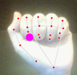
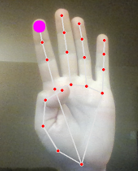
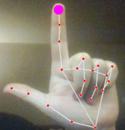
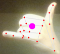

<div align='center'>

# Handler

#### Handler uses the OpenCV and Mediapipe libraries to implement gesture recognition


<br>
<br>

<!-- <div align="right">

</div> -->
</div>

## Overview
- [To do](#to-do)
- [Runtime instructions](#runtime-instructions)
- [Gestures](#gestures)
    - [Implemented](#implemented)
    - [Making changes](#making-changes)  
- [Useful links](#useful-links)

<br>


## Runtime instructions
1. Navigate to the projects directory
2. Create a virtual environment via ```python -m venv ./.env```
3. Activate virtual environment via ```.env/Scripts/activate```
4. Install dependencies via ```python -r requirements.txt```
5. Navigate to src
6. run ```python main.py```
7. **To exit the application, press *q***
    - Note that the window must be opened for the application to close

## Gestures
### Implemented

|Fist|Thumb In|L|Surfs up|
|-|-|-|-|
|Minimizes the window|Performs left click|Performs right click|Takes a screenshot|
 |  |  | 

### Making changes
1. Create a new gesture:  
All new gestures should be added to the gesture folder and should implement the [gesture base class](https://github.com/DaneHarrison/Handler/blob/main/src/gestures/gesture.py) as well as some sort of cooldown to prevent duplicate actions

2. Adding it to HandTracker:  
The list of gestures, where new gesture should be added to, can be found in the [HandTracker](https://github.com/DaneHarrison/Handler/blob/main/src/handTracker.py) constructor. Not that the once a gesture is detected, all other checks are abandoned. In short, **order matters**

3. Distances:
Currently, gestures are detected based on distances between different hand points, however, these will vary between users and how close a user is to their camera. Therefore, it is important that all distances for all future changes be calculated in a similar range i.e **[38 - 45]** as seen in the [setup file](https://github.com/DaneHarrison/Handler/blob/main/src/gestures/setup.py)

4. Testing:  
Gestures are detected by distances between different hand points, therefore, to test which hand points are most unique to a given gesture it is useful to use the setup gesture. This option can easily be toggled through the SETUP_MODE constant  in [main](https://github.com/DaneHarrison/Handler/blob/main/src/main.py)

<br>

## Useful links
- [Google's overview of media pipe (used to detect fingers)](https://developers.google.com/mediapipe/solutions/vision/hand_landmarker)
- [Finger detection sample code](https://mediapipe.readthedocs.io/en/latest/solutions/hands.html)
- [Media pipe github repository](https://github.com/google/mediapipe/blob/master/mediapipe/python/solutions/hands.py)
- [OpenCV's documentation](https://docs.opencv.org/3.4/d2/d75/namespacecv.html)